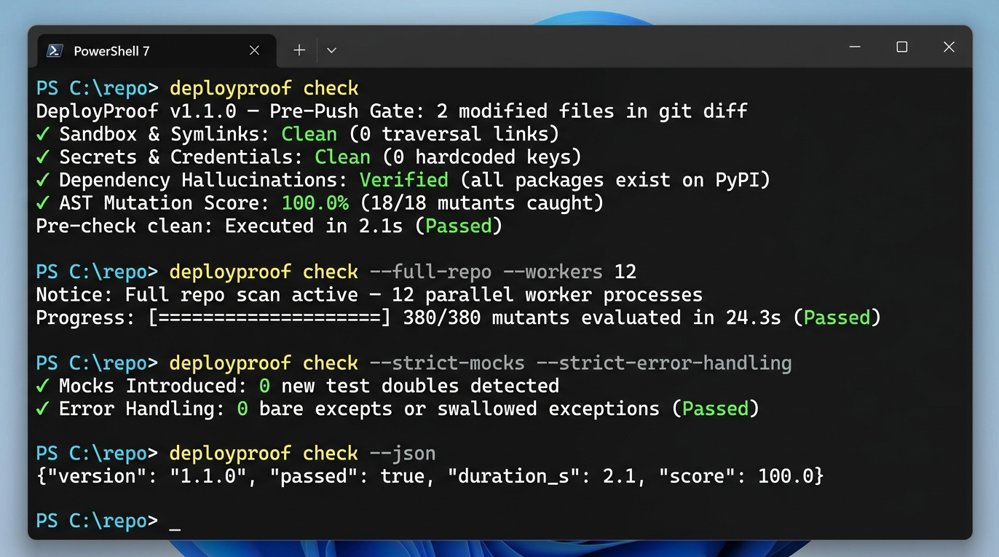
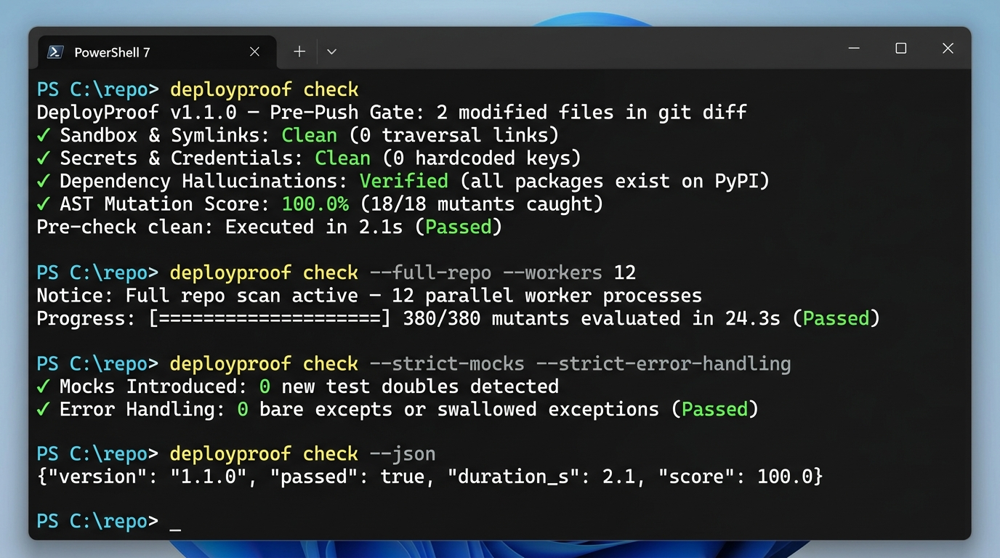

# DeployProof &nbsp;·&nbsp; `pip install deployproof`

**Python CLI** — pre-push AI-code verification, AST mutation testing & self-healing test synthesis. Verifies your code locally in **2–5 seconds** before commit or CI.


[](https://pypi.org/project/deployproof/)
[](https://pypi.org/project/deployproof/)
[](https://github.com/SVSPraveen/deployproof/actions/workflows/ci.yml)
[](https://github.com/SVSPraveen/deployproof)
[](stress_fixtures/)
[](LICENSE)
[](https://svspraveen.github.io/deployproof/)

<p align="center">
  
</p>

---

> 📖 **[View the Complete Interactive Product Portal & Live Docs](https://svspraveen.github.io/deployproof/)**  
> 💡 *Curious why we built it this way? Read our architectural rationale in **[DECISIONS.md](DECISIONS.md)**.*

---

## Contents
- [Why This Exists](#why-this-exists)
- [How It Compares: DeployProof vs. Mutmut vs. Cosmic Ray](#how-it-compares)
- [Installation](#installation)
- [Quickstart & Walkthrough](#quickstart--walkthrough)
- [How It Works (Diff-Scoped, Full Repo, & WSL)](#how-it-works)
- [The 7 Verification Gates](#the-7-verification-gates)
- [Windows WSL Delegation](#3-windows-wsl-delegation-deployproof-check---wsl--native-linux-speed-on-windows)
- [Architecture & Design Rationale (`DECISIONS.md`)](#architecture--design-rationale)
- [CI/CD & Pre-Commit Integration](#cicd--pre-commit-integration)
- [Configuration (`pyproject.toml`)](#configuration-pyprojecttoml)
- [Full Documentation & CLI Reference](#full-documentation--cli-reference)

---

## Why This Exists

Modern software development — whether written by human engineering teams or generated through AI coding assistants — introduces subtle failure modes that standard linters and line-coverage metrics completely miss:

* **Deceptive Test Suites**: Test suites boasting 90%+ line coverage that never assert true correctness, masking near-zero mutation scores.
* **Accidental Credential Exposure**: Hardcoded API keys, bearer tokens, or service credentials generated in passing or pasted into tests.
* **Sandbox Escape Risks**: Symlinks that deceive tool approval prompts into breaking outside the repository sandbox.
* **Silently Swallowed Exceptions**: Blanket `except Exception: pass` anti-patterns that hide critical runtime bugs.
* **Dependency Hallucinations & Slopsquatting**: Package names invented by LLMs or mistyped dependencies that don't exist on public PyPI.

DeployProof serves as an uncompromising, deterministic pre-push gate that validates code quality, test integrity, and security locally before any commit reaches CI or production.

> **Privacy & Security Guarantee**: DeployProof runs 100% locally on your machine with zero external telemetry. The only outbound network requests are read-only queries to (1) the official PyPI registry (`https://pypi.org/pypi/<pkg>/json`) to verify that newly introduced dependencies exist, and (2) the open OSV database (`https://api.osv.dev/v1/query`) when CVE scanning is active (can be disabled with `--no-check-cve`). DeployProof sends no source code, telemetry, test results, or secret findings to any external server.

---

## How It Compares

Traditional mutation testing tools re-run full test suites against disk-modified files for hours. DeployProof was built from the ground up for instantaneous pre-commit loops using **in-memory AST mutation schemata**, **process sandboxing**, and **unified security scanning**:

| Feature / Capability | DeployProof | mutmut | Cosmic Ray |
|---|:---:|:---:|:---:|
| **Git Diff Speed (Pre-Commit)** | **2 – 5 Seconds** *(Diff-Scoped + Fail-Fast)* | Hours (Full sweeps) | Hours (Full sweeps) |
| **Mutation Engine** | **In-Memory AST Schemata** | File rewrite to disk | AST disk rewriting |
| **Self-Healing Test Synthesis** | **Yes (`--heal-tests` / `-i`)** | No | No |
| **Async / Await Dropping** | **Yes** | No | No |
| **Argument Swapping & Dict Fallbacks** | **Yes** | No | No |
| **Context Manager Bypass (`with` / `async with`)** | **Yes** | No | No |
| **Credential & Git History Leaks (50 commits)** | **Yes (Shannon Entropy)** | No | No |
| **AST OWASP Top 10 SAST Scanner** | **Yes (Zero-dependency)** | No | No |
| **Dependency Hallucination Defense (PyPI)** | **Yes** | No | No |
| **CVE Vulnerability Defense (OSV)** | **Yes** | No | No |
| **Symlink Sandbox Escape Defense (CWE-61)** | **Yes** | No | No |
| **Isolated Multi-Worker Sandboxes** | **Yes (`--workers N`)** | No | Distributed (Celery) |
| **Automated Persistent Audit Logs** | **Yes (`.deployproof/report.txt`)** | No | SQLite DB |
| **Native GitHub Actions Step Summaries** | **Yes (`--github-actions`)** | No | No |

---

## Installation

```bash
pip install deployproof

# Recommended: isolated environment with global CLI access
pipx install deployproof
```

*Requires Python 3.10+.*

---

## Quickstart & Walkthrough

<p align="center">
  
</p>

### The Problem in Action

Given a newly written function `calculator.py`:

```python
def calculate_discount(price: float, rate: float) -> float:
    if rate > 0.5:
        return price * 0.5
    return price * (1.0 - rate)
```

With an AI-generated test that achieves **100% line coverage** by only asserting a single happy path (`rate = 0.2`):

```python
def test_calculate_discount_basic():
    assert calculate_discount(100.0, 0.2) == 80.0
```

Running `deployproof check` mutates AST operators in memory and immediately exposes that threshold caps and boundaries are unverified:

```
$ deployproof check

Target Scope (1 file evaluated):
  * calculator.py

Local Pre-Check Mutation Verification:
  Score:  57.1% (4/7 mutants killed)
  Status: FAILED (score 57.1% below 80.0%)
  Time:   2.27s

Surviving Mutants (3 unverified changes):
  [1] calculator.py:2  Mutation: Replace numeric constant '0.5' with '1.5'
  [2] calculator.py:3  Mutation: Replace numeric constant '0.5' with '1.5'
  [3] calculator.py:3  Mutation: Replace binary operator '*' with '/'

Pre-check FAILED: Score 57.1% is below threshold 80.0% (3 surviving mutants).
```

### Self-Healing the Test Suite

Run with `--heal-tests` (or interactively with `-i`) to automatically synthesize ready-to-run pytest unit tests that target the exact surviving mutants:

```bash
deployproof check --heal-tests
```

```python
# Generated in tests/test_deployproof_healed.py
def test_calculate_discount_boundary_rate():
    assert calculate_discount(100.0, 0.5) == 50.0

def test_calculate_discount_capped_rate():
    assert calculate_discount(100.0, 0.8) == 50.0
```

Re-running `deployproof check` immediately passes:

```
Local Pre-Check Mutation Verification:
  Score:  100.0% (7/7 mutants killed)
  Status: PASSED (threshold: 80.0%)
  Time:   2.31s

Surviving Mutants: None (All generated mutants caught by test suite)
Pre-check clean: 100% of tested basic mutations caught.
```

---

## How It Works

DeployProof provides two distinct, optimized execution modes:

### 1. Diff-Scoped Pre-Push Gate (`deployproof check`) — *Default Fast Mode*
Evaluates **only the files modified in your active session or git diff** (1–3 files typically). Because only newly edited AST nodes are mutated in memory, it runs in **2 to 5 seconds** in local developer loops, pre-commit hooks, and pre-push gates.

```bash
# Fast check: verifies modified files in your current git diff (2-5s)
deployproof check

# Output structured JSON for IDE tooling or custom pipelines
deployproof check --json

# Enforce strict gates on newly introduced mocks or swallowed errors
deployproof check --strict-mocks --strict-error-handling
```

### 2. Full Repository Audit Mode (`deployproof check --full-repo`) — *Thorough Audits*
Evaluates **every tracked Python file across the entire repository**, parallelizing test execution across isolated worker sandboxes:

```bash
# Full repository audit distributed across isolated parallel worker sandboxes
deployproof check --full-repo --workers 8
```

### 3. Windows WSL Delegation (`deployproof check --wsl`) — *Native Linux Speed on Windows*
On Windows, full mutation testing tools traditionally require POSIX process forking. DeployProof provides a seamless bridge via the `--wsl` flag that translates paths (safely quoting spaces), delegates mutation runs to `mutmut` inside a native Linux environment inside Windows Subsystem for Linux (WSL), and streams verified results back to your Windows console:

```bash
# Windows: delegate mutation test verification to native Linux mutmut in WSL
deployproof check --wsl
```

> ⚙️ **One-Time WSL Setup**: Configure mutmut in WSL by running:  
> `wsl bash -c "python3 -m venv ~/.deployproof-wsl-venv && ~/.deployproof-wsl-venv/bin/pip install mutmut pytest"`  
> *(If WSL or the Linux venv is not configured, DeployProof automatically falls back to the native in-memory engine with a helpful notice).*

> 📊 **Hardware & Sizing Details**: For benchmark timing matrices across open-source codebases, per-worker RAM footprints, and hardware tuning formulas, see the **[Interactive Sizing & Architecture Guide](https://svspraveen.github.io/deployproof/)**.

---

## The 7 Verification Gates

Every DeployProof check executes seven deterministic quality and security gates:

1. **Gate 1: In-Memory Schemata Mutation Engine**  
   Mutates AST operators (`>=`, `==`, `and`, `or`, `*`, numeric constants, string boundaries, async/await, argument swaps) and toggles mutants via warm RAM environment switches (`__DEPLOYPROOF_MUTANT__`), bypassing disk I/O.
2. **Gate 2: Actionable Self-Healing Test Synthesizer**  
   Analyzes surviving mutants and automatically synthesizes ready-to-run pytest unit tests with inferred parameter signatures, class method instantiation, and boundary value fixtures (`--heal-tests`, `-i`).
3. **Gate 3: AST OWASP Top 10 SAST Scanner**  
   Zero-dependency static security scanner detecting SQL injection, command execution (`shell=True`, `os.system`), insecure deserialization (`pickle`, `yaml.load`), path traversals, and disabled SSL verification.
4. **Gate 4: Secrets & 50-Commit Git History Scanner**  
   Scans session files and the past 50 git commits using Shannon entropy analysis to detect committed API keys (OpenAI, Anthropic, AWS, GitHub, Stripe) and private credentials.
5. **Gate 5: Dependency CVE & Slopsquatting Defense**  
   Cross-references requirements against the open OSV database for known CVEs and queries PyPI JSON API in real time to catch hallucinated package names.
6. **Gate 6: CWE-61 Symlink Sandbox Escape Gate**  
   Resolves symbolic links and blocks any whose target resolves outside the repository root (GhostApproval defense).
7. **Gate 7: Control Flow & Error Handling Gate**  
   Detects bare `except:`, swallowed exceptions (`except Exception: pass`), unreachable dead code, and mock leaks (`--strict-mocks`, `--strict-error-handling`).

---

## Architecture & Design Rationale

Curious why DeployProof was architected with in-memory AST schemata instead of file rewrites, why it uses a dual-tier verification model, or how it mitigates LLM-generated code risks?

👉 **Read [DECISIONS.md](DECISIONS.md)** for our complete technical design document, performance trade-off analyses, AST mutation safety proofs, and threat models.

---

## CI/CD & Pre-Commit Integration

### GitHub Actions
Add `.github/workflows/deployproof.yml` to emit PR inline annotations and visual Markdown dashboards to `$GITHUB_STEP_SUMMARY`:

```yaml
name: DeployProof Gate
on: [push, pull_request]

jobs:
  verify:
    runs-on: ubuntu-latest
    steps:
      - uses: actions/checkout@v4
        with:
          fetch-depth: 50
      - uses: actions/setup-python@v5
        with:
          python-version: '3.12'
      - run: pip install -e . && pip install deployproof pytest
      - run: deployproof check --github-actions --workers 4
```

### Pre-Commit Framework (`.pre-commit-config.yaml`)
```yaml
repos:
  - repo: https://github.com/SVSPraveen/deployproof
    rev: v1.1.17
    hooks:
      - id: deployproof-check
```

---

## Configuration (`pyproject.toml`)

DeployProof natively supports standard PEP 518 `pyproject.toml` configuration under `[tool.deployproof]`:

```toml
[tool.deployproof]
threshold = 85.0
workers = 8
timeout = 15.0
strict_mocks = true
strict_error_handling = true
sast_scanning = true
history_secrets_scanning = true
cve_scanning = true
generate_tests = "tests/test_deployproof_healed.py"
```

---

## Full Documentation & CLI Reference

For exhaustive CLI flag references, JSON output schemas, Windows WSL configurations, and advanced customization guides:

👉 **[Explore the Interactive DeployProof Portal & Docs Site](https://svspraveen.github.io/deployproof/)**

---

## Contributing

Issues and pull requests are welcome. Open an issue first for significant changes so the approach can be discussed before implementation.

## License

MIT. See [LICENSE](LICENSE).

---

*Created & Architected by [SVS Praveen](https://github.com/SVSPraveen) · [Portfolio](https://svspraveen.vercel.app/) · [LinkedIn](https://www.linkedin.com/in/svs-praveen-s/)*
